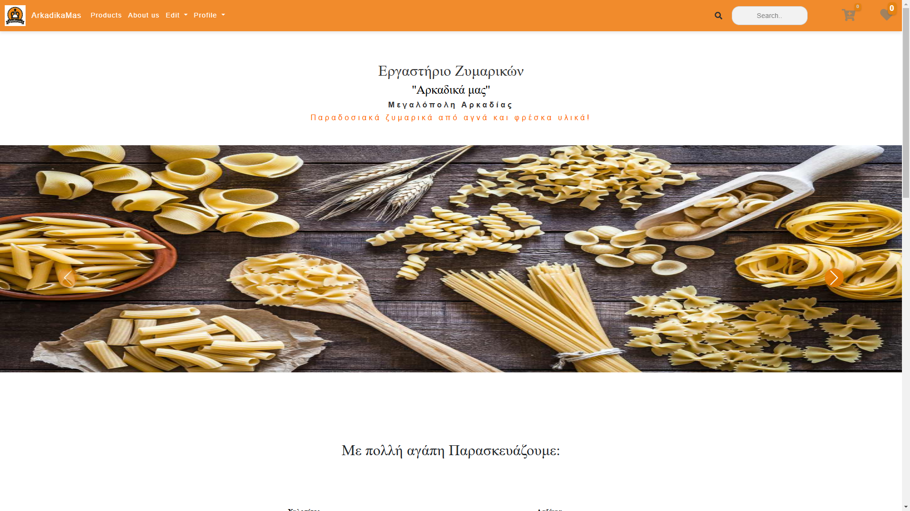
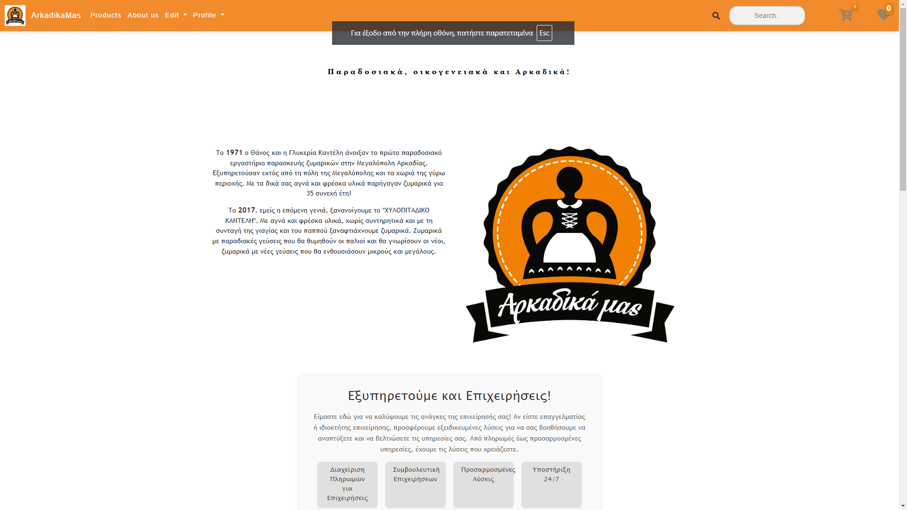
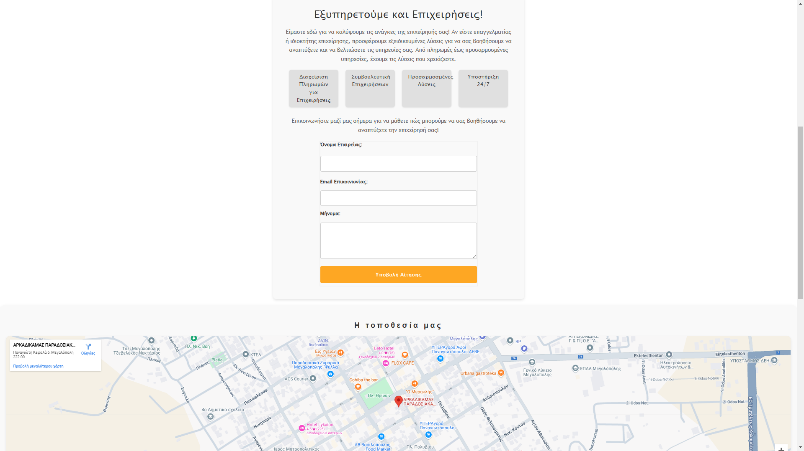
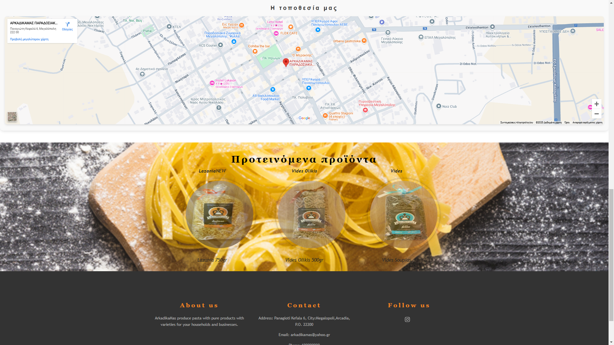
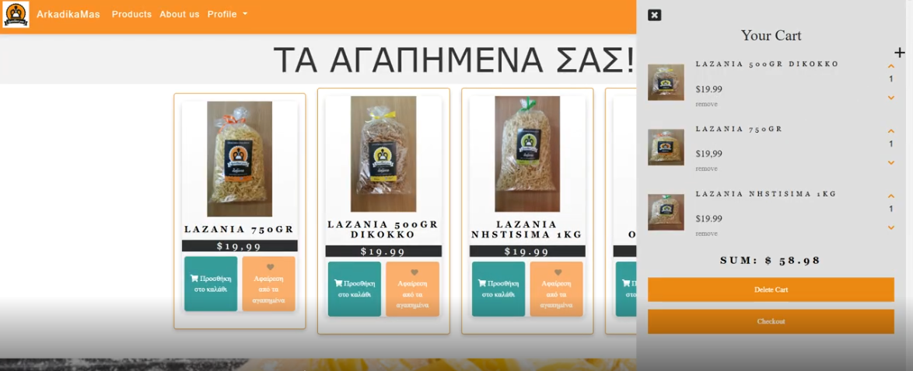
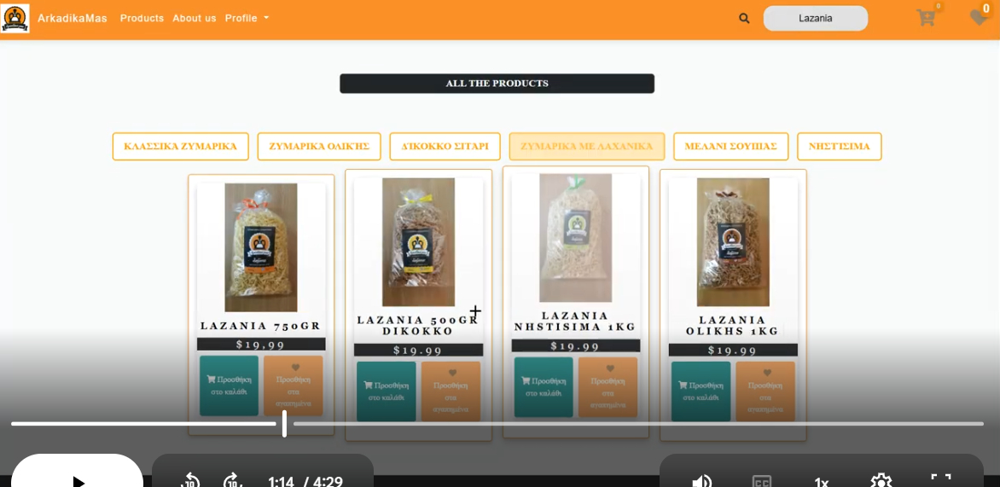
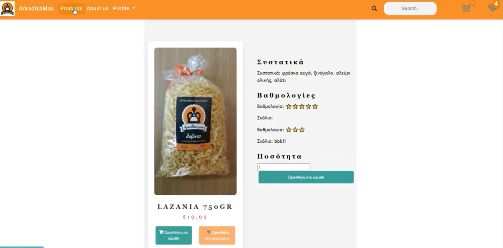
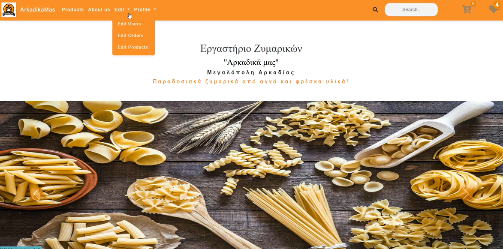

Αρκαδικά μας
Overview

Αρκαδικά μας is a full-stack e-commerce web application developed as part of an academic project. The platform allows users to browse products, manage their cart and favorites, place orders, manage their profile information, and complete virtual payments.

The application also includes a complete administrator panel for managing products, users, and customer orders.

## Demo Video

Watch the full application demo here:

[View Demo Video](https://drive.google.com/file/d/1ugXFKu1s3D5iYcRn748IGKqW_gtbe_1W/view)

Features
 User Features
*User registration and authentication
*Product browsing and product details pages
*Shopping cart functionality
*Favorites/Wishlist system
*Virtual payment workflow
*Order placement and management
*User profile editing
*Responsive user interface

 Admin Features
*Product management
*Product editing and updates
*User management
*Order management
*Administrative dashboard functionality

Technologies Used
 Frontend
*HTML
*CSS
*JavaScript
 Backend
*PHP
 Database
*MongoDB

Screenshots
Home Page

About Us

Shopping Cart

Products

Product Details

Admin Panel

Main Functionalities
Authentication system
Shopping cart and favorites logic
Product management system
Order processing workflow
User profile management
Admin panel for products, orders and users
Database integration with MongoDB

Installation

Clone the repository
git clone https://github.com/ChristAris/ArkadikaMas.git

Navigate to project folder
cd ArkadikaMas

Configure database connection
Set up your MongoDB connection inside the backend configuration files.

Run the application

Run the project through a local PHP server environment such as:

XAMPP
Laragon
WAMP

Future Improvements
Real payment gateway integration
Better responsive optimization
Product filtering and sorting
Email notifications
Improved admin dashboard
Cloud deployment
Author

Χρήστος Αριδάς

GitHub:
https://github.com/ChristAris
